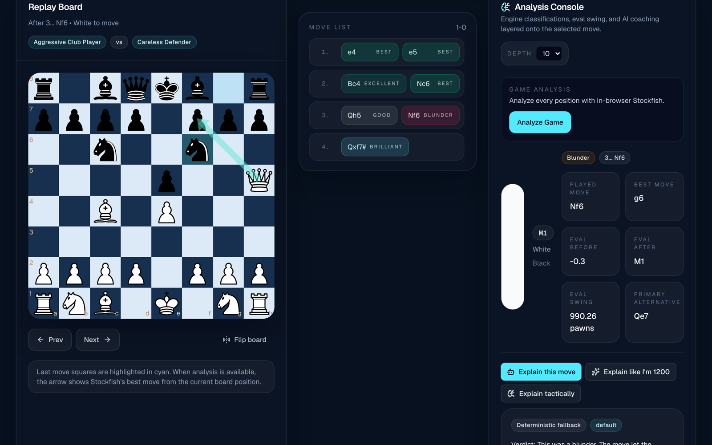

# Stockfih

Chess analysis that runs Stockfish in your browser and turns its output into
short coaching: not only "what was the best move?" but "what was the idea I
missed?"



*The sample game (a Scholar's Mate). After 3...Nf6, Stockfish flags the blunder,
shows the best move (g6), and draws the mating threat on the board.*

## What it does

- Parses a PGN and replays the game on a board with arrow-key navigation
- Runs Stockfish 18 (WASM) in a Web Worker, entirely client-side
- Scores every position before and after each move, at depth 8 to 14
- Labels moves from Best to Blunder by centipawn loss, and shows the best move
  and the main alternative
- Explains a move in three styles (default, "like I'm 1200", tactical) through
  a server route that keeps the model token off the client
- Falls back to deterministic template explanations when no token is set
- Caches explanations in `localStorage`

Engine facts and model commentary are kept visibly separate, so the language
model can explain the analysis but can't replace it.

## Run it

Needs Node 20.9+.

```bash
npm install      # also copies the Stockfish build into public/stockfish/
npm run dev      # http://localhost:3000
```

Click **Load sample game**, then **Analyze Game**, then pick a move.

For model-written explanations, create `.env.local`:

```bash
HF_TOKEN=hf_...
HF_MODEL=mistralai/Mistral-7B-Instruct-v0.3   # any chat model served by the HF router
```

Requests go to Hugging Face's OpenAI-compatible router. Without `HF_TOKEN`
everything still works; explanations come from templates.

Tested on macOS (Apple Silicon) with Node 24: installs, builds, and analyzes
the sample game in the browser.

## Known issues

- **Mate scores leak into the eval swing.** When a move allows mate, the swing
  shows as a raw number ("990.26 pawns") instead of "allows mate in 1".
- **"Brilliant" and "Great" are too generous.** Any best move that delivers
  mate is labelled Brilliant, and any best move that captures, checks, or
  castles is labelled Great. In the sample game, the routine `Qxf7#` is
  "Brilliant".
- **Analysis is sequential.** Long games at depth 14 take a while.
- `npm run lint` reports two errors (`prefer-const`, `no-explicit-any`).

## Project structure

```text
app/api/explain/route.ts   model call, server-side only
components/                board, move list, analysis console, PGN input
lib/stockfish.ts           Web Worker client for the engine
lib/classify.ts            move classification and eval formatting
lib/prompts.ts             explanation prompts
scripts/copy-stockfish.mjs postinstall copy from node_modules/stockfish
```

## Licensing

Stockfih's own code is MIT. The Stockfish engine files in `public/stockfish/`
are **GPLv3**, from the [`stockfish`](https://www.npmjs.com/package/stockfish)
npm package; their license text ships alongside them in `Copying.txt`.

## Stack

Next.js 16, React 19, TypeScript, Tailwind CSS 4, chess.js, react-chessboard,
Stockfish 18 WASM.
